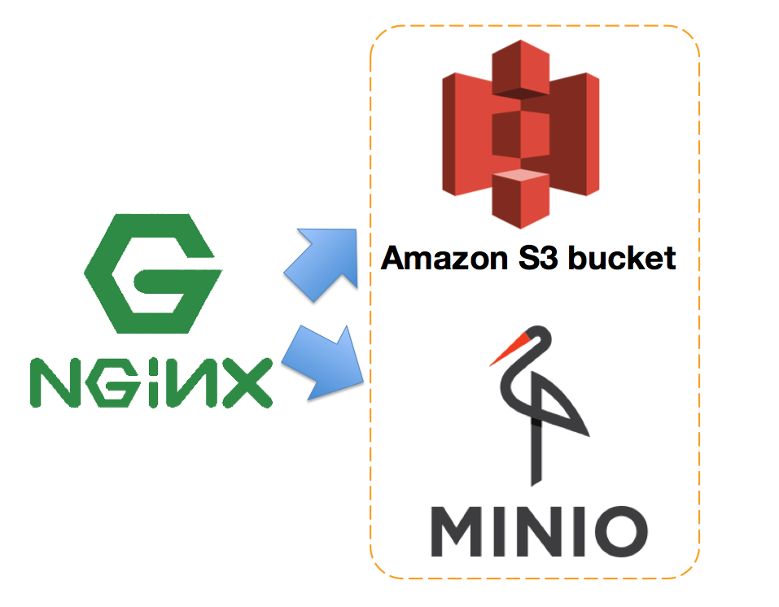

# nginx-image-resizer



Docker Container of real time image resizing and caching

## Build Image

```bash
docker build -t appleboy/nginx-image-resizer .
```

## RUN Image

```bash
docker run --restart always \
  -p 8002:80 \
  -e NGINX_HOST=localhost \
  -e IMAGE_HOST="http://localhost:9000" \
  appleboy/nginx-image-resizer
```

## Paramemter

| Parameter   | required | default value |
|-------------|--------|----|
| NGINX_HOST  | true   |    |
| IMAGE_HOST  | true   |    |
| JPG_QUALITY | false  | 95 |
| EXPIRE_TIME | false  | 7d |
| MEMORY_SIZE | false  | 20m |
| CACHE_NAME | false  | cache_zone |
| CACHE_SIZE | false  | 40m |
| INACTIVE_TIME | false  | 30d |

## example

Start [minio](https://minio.io/) and nginx-image-resizer using docker-compose.yml

```sh
docker-compose up -d
```

Default access key and secret key as following. create new bucket and uploade test image.

```sh
MINIO_ACCESS_KEY: YOUR_MINIO_ACCESS_KEY
MINIO_SECRET_KEY: YOUR_MINIO_SECRET_KEY
```

set bucket as public permission.

```sh
mc config host add minio http://localhost:9000 MINIO_ACCESS_KEY MINIO_SECRET_KEY
mc anonymous set public minio/test
```

open browser as following

```sh
# format 1: http://localhost:8002/resize_image_width/bucket_name/image_name
http://localhost:8002/300/test/test.png
# format 2: http://localhost:8002/${image_width}x${image_height}/bucket_name/image_name
http://localhost:8002/300x200/test/test.png
```

## Benchmark

without nginx proxy cache:

```sh
echo "GET http://localhost:8002/310/test/26946324088_5b3f0b1464_o.png" | vegeta attack -rate=100 -connections=1 -duration=1s | tee results.bin | vegeta report
Requests      [total, rate]            100, 101.01
Duration      [total, attack, wait]    8.258454731s, 989.999ms, 7.268455731s
Latencies     [mean, 50, 95, 99, max]  3.937031678s, 4.079690985s, 6.958110121s, 7.205018428s, 7.268455731s
Bytes In      [total, mean]            4455500, 44555.00
Bytes Out     [total, mean]            0, 0.00
Success       [ratio]                  100.00%
Status Codes  [code:count]             200:100
Error Set:
```

with nginx proxy cache:

```sh
echo "GET http://localhost:8002/310/test/26946324088_5b3f0b1464_o.png" | vegeta attack -rate=100 -connections=1 -duration=1s | tee results.bin | vegeta report
Requests      [total, rate]            100, 101.01
Duration      [total, attack, wait]    993.312255ms, 989.998ms, 3.314255ms
Latencies     [mean, 50, 95, 99, max]  3.717219ms, 3.05486ms, 8.891027ms, 12.488937ms, 12.520428ms
Bytes In      [total, mean]            4455500, 44555.00
Bytes Out     [total, mean]            0, 0.00
Success       [ratio]                  100.00%
Status Codes  [code:count]             200:100
Error Set:
```

## Reference

* [Nginx: Real time image resizing and caching](https://github.com/sergejmueller/sergejmueller.github.io/wiki/Nginx:-Real-time-image-resizing-and-caching)
* [NGINX reverse proxy image resizing + AWS S3](https://medium.com/merapar/nginx-reverse-proxy-image-resizing-aws-cece1db5da01)
* [Nginx dynamic image resizing with caching](https://stumbles.id.au/nginx-dynamic-image-resizing-with-caching.html)
* [High‑Performance Caching with NGINX and NGINX Plus](https://www.nginx.com/blog/nginx-high-performance-caching/)
* [NGINX and NGINX Plus Deliver Responsive Images Without the Headaches](https://www.nginx.com/blog/responsive-images-without-headaches-nginx-plus/)
